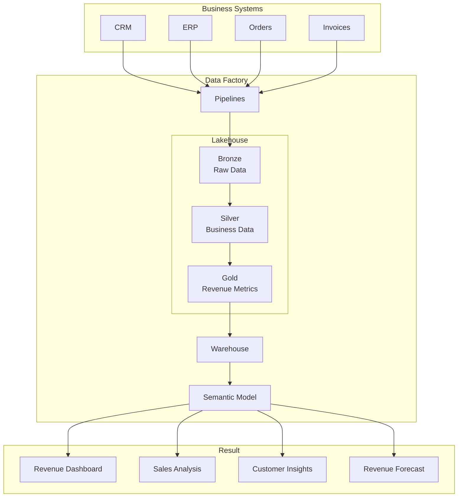

## 📊 Business Operations & Analytics

### Revenue Visibility

**Tech Stack:**

* Microsoft Fabric, Data Factory, Lakehouse, Warehouse, Power BI, DAX

**Highlights:**

- Built a revenue visibility platform using Microsoft Fabric
- Implemented Bronze, Silver, and Gold data layers
- Developed dimensional models for sales and customer analytics
- Delivered automated Power BI executive reporting

